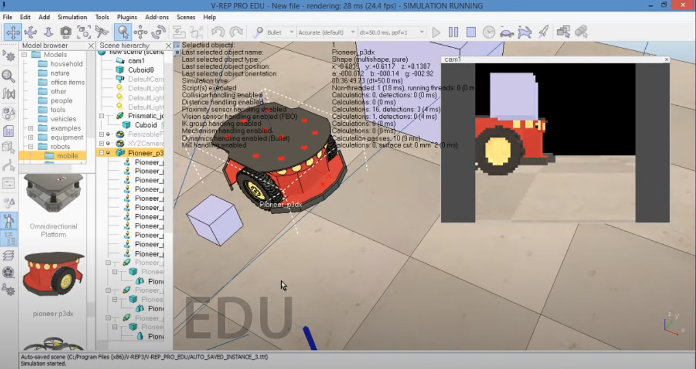
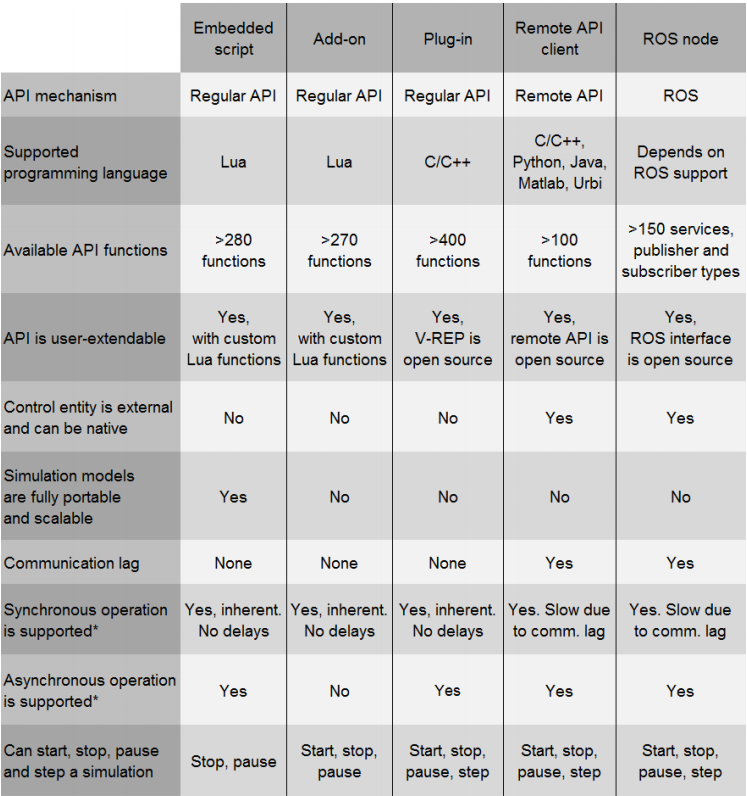
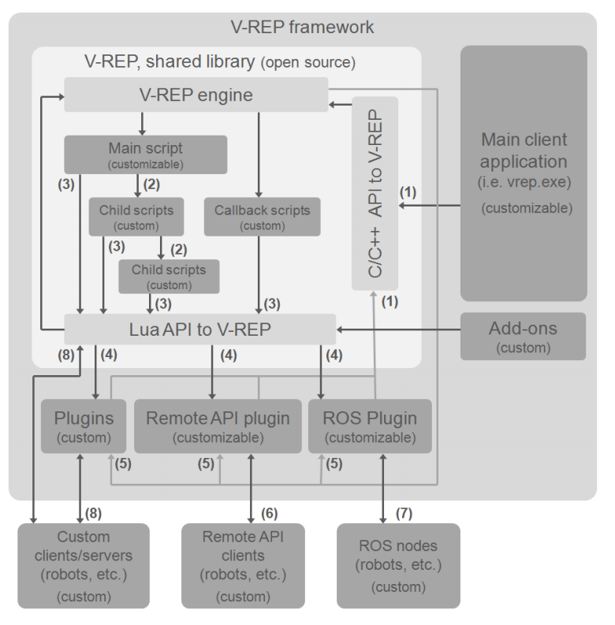
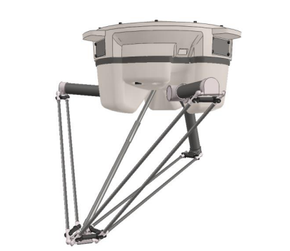
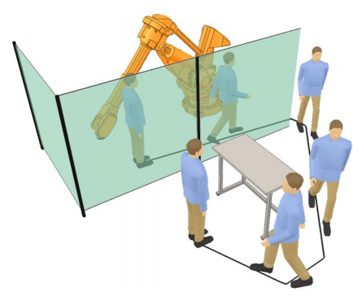

= CoppeliaSim nedir?

Bilgisayarların işlem gücündeki ve 3D grafik kartlarının gelişimi, bol miktarda açık yazılım ve donanım standartları ile birlikte robotik simülasyon ortamlarının geleceğini oldukça değiştirdi. Bu durum masaüstü bilgisayarlarda karmaşıklık yaratmasının yanı sıra, simülasyonları gerçek zamanlı olarak çalıştırma veya bir simülasyon çerçevesinden kontrol edilen mobil / gömülü sistemlere bir arada olabilme yeteneği sağladı.

Çeşitli kinematik, fizik ve grafik kitaplıklarından bir simülatör oluşturmak mümkün olsa da, mimari ve kontrol metodolojisi, bu öğelerin nasıl etkileşime girdiğini ve dolayısıyla sistemin genel performansını ve doğruluğunu belirlemek için çok önemlidir. Sağlam bir sistem yaklaşımı, çok yönlü, ölçeklenebilir ve ayrıntılı bir simülasyon stratejisini savunur.

Pratik olarak, genel amaçlı bir robot simülatörünün, sistem özellikleri öngörülemediğinden, temeldeki robotik sistemleri ve bunların karmaşıklığını soyutlarken aynı anda çok sayıda araç ve işlevsellik sağlaması gerekir. Ek olarak, taşınabilir ve kolayca kodlanabilen (ve geliştirilebilen); çeşitli modellere yani simülasyon varlıkları birden çok modeli, denetleyiciyi veya herhangi bir işlevselliği desteklemesi istenir.

Open HRP, Gazebo veya Webots şuanda piyasada bulunan robot simülasyon platformlarından bazılarıdır. Bunlardan birçoğu geniş ve tamamlayıcı bir programlama teknikleri paleti sunmada başarısız olur ve simülasyon modelleri ve kontrolörleri sadece kısmen taşınabilir. Farklı bir donanım veya platformda modelin çalıştırılması istendiğinde genellikle yeniden derlenmesi, eşleştirmelerin yeniden yapılması gerekir.

Virtual Robot Experimentation Platform ( Şekil-1 de gösterilen) - veya basitçe V-REP simülatörü - çok yönlü ve ölçeklenebilir bir simülasyon çerçevesine tüm gereksinimleri karşılamaya çalışan bir çabanın sonucudur. Geleneksel simülasyon ortamlarının sunduğu yaklaşımlara ek olarak, V-Rep birkaç yaklaşım daha sunar.

== Simülasyon Kontrolörleri

Eğer karmaşık büyük bir simülasyon senaryosu oluşturulmak isteniyorsa, dağıtık kontrol çerçevesinden neredeyse hiç kaçış yoktur. Bu sistem CoppeliaSim'in kontrol varlıklarını bölerek basitleştirip ve CPU'da ki yükü birkaç çekirdek ve hatta birkaç makineye dağıtarak azaltabilmesini sağlar. Fakat bu hedefe ulaşmak için unutulmaması gereken gereksinimler vardır.

Bunlar;

  * esneklik,
  * taşınabilirlik
  * ölçeklenebilirlik.

Diğer simülasyon kontrol gereksinimleri simülasyon döngüsüne bağlıdır. Bazı unsurlar, özellikle gerçek zamanlı hareket seviyesi kontrolörleri gibi düşük seviyeli kontroller, simülasyon döngüsü ile senkronizasyon gerektirir.

== Ortak teknikler

=== Kontrol kodunu ve simülasyon döngüsünü aynı makinede / threadde yürütme

Bu yaklaşımın ana avantajı, simülasyon döngüsü ile doğal senkronizasyon ve herhangi bir yürütme, iletişim veya iş parçacığı değiştirme gecikmesi veya gecikmesinin olmamasıdır. Ancak bu, yalnızca simülasyon döngüsü CPU çekirdeğindeki artan yük ile mümkün olur. Bu kontrol tekniği genellikle simülatör tarafından yüklenen eklentiler aracılığıyla uygulanır. Yukarıdaki tekniklerin en yaygın uygulamaları (yani, harici yürütülebilir dosyalar veya eklentilerin kullanılması) doğrudan bir sonuç olarak, zayıf taşınabilirliğe ve simülasyon modellerinin zayıf ölçeklenmesine sahiptir: aslında, kontrol kodu, ilgili simülasyon modeline eklenmediğinden, ayrı olarak dağıtılmalı / derlenmeli / kurulmalıdır. Bu, platformlar arasındaki uyumluluk sorunlarını ve diğer kitaplıklarla olan çakışma / bağımlılık sorunlarını artırır. Her küçük kod değişikliği için bir yürütülebilir dosyayı / eklentiyi yeniden derlemek ve yeniden yüklemek gerekeceğinden esneklik de azalır. Bir çoklu robot simülasyon senaryosunda olduğu gibi, model çoğaltma, her simülasyon modeli örneği için yeni kontrol örnekleri başlatan donanımla bağlantılı mekanizmalar aracılığıyla desteklenmelidir.

=== Kontrol kodunu ve simülasyonü döngüsün aynı makinede ancak farklı bir işlemde / threadde yürütme

Burada ayrıca, CPU çekirdeklerinde azaltılmış veya daha dengeli bir yükten faydalanabiliriz, ancak buna simülasyon döngüsü ile senkronizasyon eksikliği eşlik ediyor. Ve çoğu zaman, bir iletişim gecikmesi veya iş parçacığı değiştirme gecikmesi ile birlikte gelir. Bu kontrol tekniği genellikle simülatör tarafından yüklenen harici yürütülebilir dosyalar veya eklentiler aracılığıyla uygulanır.

=== Kontrol kodu başka bir makinede yürütme

Bu, simülatör makinesine belirli bir ağ aracılığıyla bağlanan farklı bir makineyi veya bir robotu temsil edebilir. Aracılığıyla bağlanan farklı bir makineyi veya bir robotu temsil edebilir. Bu yaklaşımın ana avantajı, denetleyicinin orijinalliğidir (kontrol kodu yerel olabilir ve orijinal donanım üzerinde çalışır). Diğer bir avantaj, simülasyon makinesindeki azaltılmış hesaplama yüküdür. Öte yandan, bu yaklaşım simülasyon döngüsü ile senkronizasyon ve ağ tarafından dikte edilen iletişim gecikmesi / gecikmesi açısından ciddi sınırlamalar getirir.

== V-REP implementasyonu
V-REP, kullanıcının aynı anda (Tablo 1) ve hatta simbiyotik olarak (Şekil 2) çeşitli programlama teknikleri arasından seçim yapmasına izin verir. Bunlar;

 * Embedded scripts,
 * Add-on,
 * Plug-ins,
 * Remote API clients,
 * ROS nodelarıdır.

== Simülasyon İşlevselliği

V-REP, çok yönlü bir mimari etrafında tasarlanmıştır. V-REP'de ana veya merkezi işlev yoktur. Daha ziyade, V-REP, yine bir model bazında gerektiğinde etkinleştirilebilen veya devre dışı bırakılabilen çeşitli nispeten bağımsız işlevlere sahiptir. Endüstriyel bir robotun kutuları alması ve başka bir yere götürmesi gereken bir simülasyon senaryosu hayal edin; VREP, kutuları kavrama ve tutma dinamiklerini hesaplar ve dinamik efektler ihmal edilebilir olduğunda döngünün diğer bölümleri için kinematik bir simülasyon gerçekleştirir.   Bu yaklaşım, endüstriyel robotun hesaplamasını mümkün kılar. tamamen karmaşık dinamik kütüphaneleri kullanılarak simüle edilmiş olsaydı durum böyle olmazdı.
Robot sert ve sabitse ve çevresinden başka türlü etkilenmiyorsa, bu tür bir hibrit simülasyon bu durumda haklı çıkar.

V-REP, çeşitli işlevselliklerini seçici bir şekilde uyarlamalı bir şekilde etkinleştirmenin yanı sıra, bunları, birinin diğeriyle işbirliği yaparak simbiyotik bir şekilde de kullanabilir. Örneğin bir insansı robot durumunda, VREP bacak hareketlerini, ilk önce her bacak için ters kinematik hesaplayarak; ve sonra hesaplanan eklem konumlarının dinamik modül tarafından hedef eklem konumları olarak kullanılmak üzere atanması. Bu, insansı hareketin çok yönlü bir şekilde belirlenmesine olanak tanır, çünkü her ayağın 6 boyutlu bir yolu takip etmesi gerektiğinden: geri kalan hesaplamalar otomatik olarak yapılır. 

İşlevsellik, belirli sahne nesneleri veya belirli hesaplama modülleri ile ilgilidir, bunların her ikisi de aşağıda açıklanmaktadır.

=== Sahne nesneleri

 * Eklemler
 * Şekiller
 * Yakınlık sensörleri
 * Görüş sensörleri
 * Kuvvet sensörleri
 * Grafikler
 * Kameralar
 * Işıklar
 * Yollar
 * Kuklalar
 * Frezeler

=== Hesaplama modülleri

 * Kinematik modülü
 * Dinamik modülü
 * Çarpışma algılama modülü
 * Kaplama-kaplama arası mesafe modülü
 * Yol, hareket planlama modülü

V-REP, çok yönlü ve ölçeklenebilir bir simülasyon çerçevesi olarak tanıtıldı. Denetleyicileri için çok sayıda farklı programlama tekniği sunarak ve simülasyon modellerine denetleyicileri ve işlevleri yerleştirmeye izin vererek, programcıların görevini kolaylaştırır ve kullanıcılar için dağıtım karmaşıklığını azaltır. 

Şu anda V-REP, akademik ve endüstriyel alanda mevcut olan sağlam ve yaygın olarak kullanılan bir robot simülatörü ve denetleyicisine dönüşmüştür. Sistem doğrulama, algoritma optimizasyonu, fabrika otomasyon uygulamalarında karmaşık montaj zincirlerinin simülasyonundan robot görev planlayıcı ve denetleyiciye kadar çeşitli görevleri gerçekleştirir.

== Neden V-Rep sonlandırıldı?

V-REP'in geliştirilmesine 26 Kasım 2019 tarihinde son verilip tüm çabalarımızı CoppeliaSim'e odaklanmıştır. CoppeliaSim, V-REP ile% 100 uyumludur (yani, V-REP projesinin bir çatalıdır). Daha hızlı çalışır ve V-REP'den daha fazla özelliğe sahiptir. Elbette Coppelia Robotics, V-REP desteğini ve lisanslarını CoppeliaSim desteği ve lisansları ile mükemmel bir şekilde değiştirilebilir bir şekilde yönetecektir. Yani aslında v-rep sonlandırılmamıştır. Kısacası birçok özellik eklenip ismi değiştirilmiştir. Bu güncellemeyle gelen değişiklikler;

 * XML dosyalarını import/export özelliği,
 * API belgelerini mouse ile açabilme,
 * ROS 2 desteği,
 * Sahneyi glTF olarak kaydedebilmeyi sağlayan bir add-on,
 * Kamera işleyicisi olarak OpenGL3 desteği,
 * RLBench,
 * Niryo One robotu,
 * Franka Emin Panda robotu,
 ve bazı fonksiyonlardır